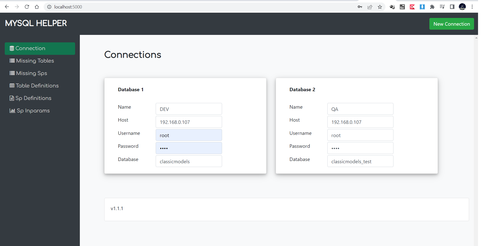
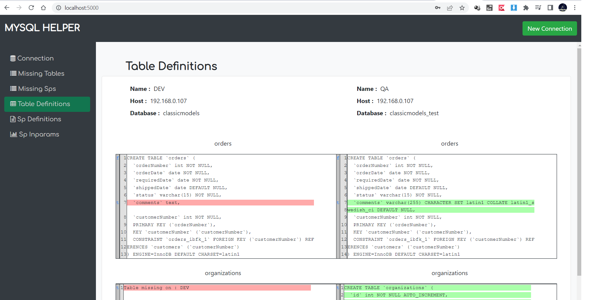

# MySQL_Helper
Tool to find difference between two mysql databases.

## Features
To find
* Missing Tables
* Missing Stored Procedures
* Difference b/w Table Definitions
* Difference b/w Stored Procedure Definitions
* Difference b/w Stored Procedure In Parameters

## Dependencies
Docker

## To run application
1. Use command "docker-compose up"
2. Access application at http://localhost:5000/

## Youtube link
https://youtu.be/VnykJY2KCxw

## Application Screenshots

### Image 1

### Image 2

